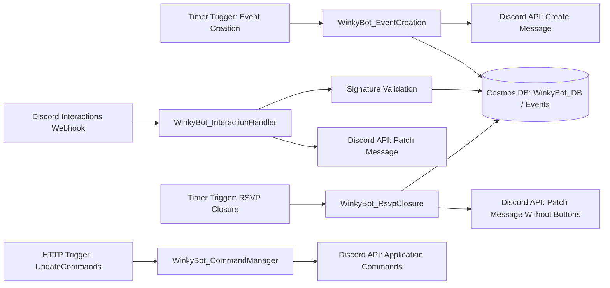

# WinkyBot

WinkyBot is a Discord event orchestration bot built with **Azure Functions (Isolated .NET 10)** and **Azure Cosmos DB**.
It automates weekly event posting, collects RSVP responses through Discord interaction buttons, and closes RSVP windows on schedule.

## What It Does

- Posts a weekly event message to a Discord channel using a timer-triggered Azure Function.
- Stores each event and RSVP state in Cosmos DB.
- Verifies Discord interaction signatures (Ed25519) before processing responses.
- Updates the original Discord message in-place when users change RSVP status.
- Removes RSVP buttons when the RSVP window closes (timer-triggered closure function).

## Architecture



## Azure Functions Surface

### 1. Event Creation (Timer Trigger)

- **Function name:** `WinkyBot_EventCreation`
- **Trigger:** `TimerTrigger("0 10 * * 2")`
- **File:** `WinkyBot_EventCreation.cs`
- **Behavior:**
	- Computes the upcoming Friday 8:00 PM in Central Time.
	- Creates a Discord embed with RSVP buttons (`Attending`, `Tentative`, `Late`, `Absent`).
	- Sends message to Discord.
	- Persists event document to Cosmos DB.

### 2. Interaction Handler (HTTP Trigger)

- **Function name:** `WinkyBot_InteractionHandler`
- **Route:** `POST /api/discord/interactions`
- **File:** `WinkyBot_InteractionHandler.cs`
- **Behavior:**
	- Verifies Discord signature headers:
		- `X-Signature-Ed25519`
		- `X-Signature-Timestamp`
	- Handles Discord `PING` interactions.
	- Parses button payload `event:{eventId}:{responseType}`.
	- Upserts RSVP updates in Cosmos DB.
	- Patches the existing Discord message to reflect current RSVP state.

### 3. RSVP Closure (Timer Trigger)

- **Function name:** `WinkyBot_RsvpClosure`
- **Trigger:** `TimerTrigger("0 0 20 * * 5")`
- **File:** `WinkyBot_RsvpClosure.cs`
- **Behavior:**
	- Finds the most recent event whose event time has passed.
	- Patches the Discord message to remove interactive buttons.

### 4. Command Sync (HTTP Trigger)

- **Function name:** `UpdateCommands`
- **Route:** `POST /api/UpdateCommands`
- **File:** `WinkyBot_CommandManager.cs`
- **Behavior:**
	- Calls Discord API to update application command registration.

## Cosmos DB Model

- **Database:** `WinkyBot_DB`
- **Container:** `Events`
- **Event schema file:** `WinkyEvent.cs`
- **Partition key assumption:** `/id` (code writes and reads with `PartitionKey(event.id)`).

### Event Document Shape

```json
{
	"id": "guid",
	"eventName": "Friday Night Games",
	"eventDateTimeUtc": "2026-07-18T01:00:00Z",
	"attending": ["userId"],
	"tentative": [],
	"late": [],
	"absent": [],
	"discordChannelId": "1234567890",
	"discordMessageId": "1234567890"
}
```

## Observability

When `APPLICATIONINSIGHTS_CONNECTION_STRING` is configured, OpenTelemetry is enabled and exported to Azure Monitor.

## Security

- Incoming Discord interactions are validated with Ed25519 signatures (`NSec.Cryptography`).
- Requests failing signature validation are rejected.
- Keep bot token and connection strings in function app settings, never in source control.

## Project Files

- `Program.cs`: host startup, dependency injection, OpenTelemetry wiring, `CosmosClient` registration.
- `WinkyBot_EventCreation.cs`: timer-driven event generation + Cosmos write.
- `WinkyBot_InteractionHandler.cs`: Discord webhook handling + RSVP persistence + message patching.
- `WinkyBot_RsvpClosure.cs`: timer-driven RSVP button closure.
- `WinkyBot_CommandManager.cs`: Discord command synchronization endpoint.
- `WinkyEvent.cs`: persisted event model.
- `DiscordSecurity.cs`: Discord request signature verification.
